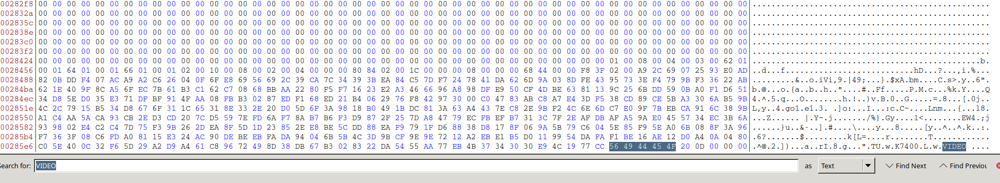
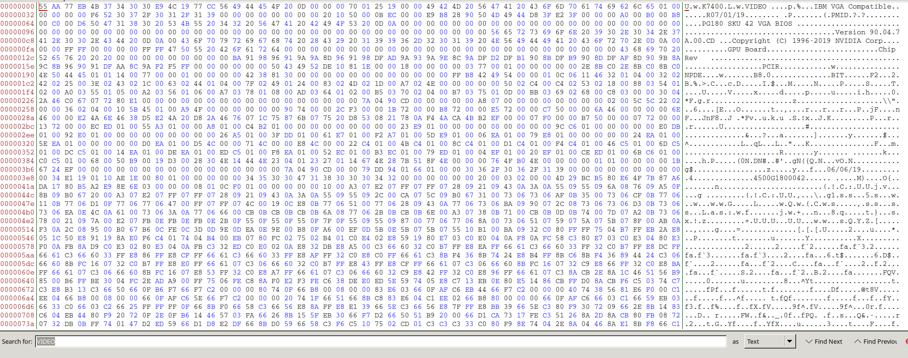
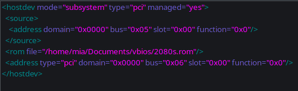
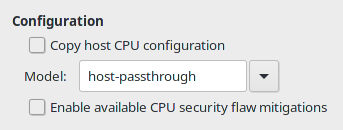

# Single GPU passthrough
> Last updated: 2022-04-14

So you wanna game but you also wanna use Linux? That's understandable. This guide should help you with that.

## Notices

!!! warning
    This guide is less of a full "here's how everything works" and more of a jumpstart into this. **PLEASE DO RESEARCH AND DO NOT RELY ON THIS ALONE** All pages I use will be at the bottom in the credits. 

!!! info "Current setup"
    The following guide is largely based on these dependencies, please make sure to change certain steps for your build. Read the credits for help.

    *    Any Linux Distro
    *    An Nvidia GPU
    *    An AMD CPU

    At some points I will provide the intel commands, but please make sure to read the credits for all the guides that go more in-depth.

!!! warning "Before Installing Linux"
    If you are still on Windows while reading this, dump your GPUs vBIOS using [GPUz](https://www.techpowerup.com/gpuz/). You're gonna need it in a much later step. Just back it up and keep it somewhere you can get to later.

Now that we got that out of the way, lets get to installing, crying, and a lot of screaming.

## Dependencies
Single GPU passthrough will need some stuff installed in order to work. Running the following list of commands will install everything for you.
> I've only fully tested on Arch and just swapped what packages needed to be installed for each distro, if there's an issue with one, please let me know.

??? info "Arch based distros"
    ```bash
    sudo pacman -S qemu libvirt edk2-ovmf virt-manager iptables-nft dnsmasq linux-headers dkms nvidia-dkms
    sudo systemctl enable --now libvirtd.service
    sudo virsh net-autostart default
    sudo virsh net-start default
    sudo usermod -aG kvm,input,libvirt <your_name>
    ```

??? info "Ubuntu"
    ```bash
    sudo apt install qemu-kvm libvirt-daemon-system dnsmasq linux-headers-`uname -r` dkms nvidia-dkms-510 # Please make sure to update this number with the latest nvidia driver
    sudo systemctl enable --now libvirtd.service
    sudo virsh net-autostart default
    sudo virsh net-start default
    sudo usermod -aG kvm,input,libvirt <your_name>
    ```

??? info "Debain"
    ```bash
    sudo apt install qemu-kvm libvirt-daemon-system iptables dnsmasq linux-headers-`uname -r` dkms nvidia-driver
    sudo systemctl enable --now libvirtd.service
    sudo virsh net-autostart default
    sudo virsh net-start default
    sudo usermod -aG kvm,input,libvirt <your_name>
    ```

??? info "Fedora"
    ```bash
    sudo dnf install qemu libvirt edk2-ovmf virt-manager akmod-nvidia
    sudo systemctl enable --now libvirtd.service
    sudo virsh net-autostart default
    sudo virsh net-start default
    sudo usermod -aG kvm,input,libvirt <your_name>
    ```

## Enable & Verify IOMMU
Before you start setting up VMs, go to your BIOS and enable either Intel VT-d or AMD-Vi + IOMMU depending on your processor and motherboard.

After enabling that in your BIOS you're now gonna have to edit grub and add either one of the following depending on your processor:

| /etc/default/grub |
| ----- |
| `GRUB_CMDLINE_LINUX_DEFAULT="... intel_iommu=on iommu=pt video=efifb:off ..."` |
| OR |
| `GRUB_CMDLINE_LINUX_DEFAULT="... amd_iommu=on iommu=pt video=efifb:off..."` |

After you do that run `grub-mkconfig -o /boot/grub/grub.cfg` to update your config with iommu grouping enabled, and then reboot.

To verify the groups run `dmesg | grep 'IOMMU enabled'`. If it does not show up then you missed something or your system does not support it. (If that reports nothing, try running `journalctl -b 0 | grep -i iommu` instead).

After making sure that IOMMU grouping is enabled, run the following script to make sure that the groups are valid, make sure that the GPU is in it's own group with all of it's stuff:

``` bash
#!/bin/bash
shopt -s nullglob
for g in `find /sys/kernel/iommu_groups/* -maxdepth 0 -type d | sort -V`; do
    echo "IOMMU Group ${g##*/}:"
    for d in $g/devices/*; do
        echo -e "\t$(lspci -nns ${d##*/})"
    done;
done;
```
If the groups are not valid, you will need to do [ACS patching](https://wiki.archlinux.org/title/PCI_passthrough_via_OVMF#Bypassing_the_IOMMU_groups_(ACS_override_patch)), which is out of the scope of this project, follow the guide linked.

While doing this, copy all the text for your GPUs IOMMU group and save it to a file somewhere to easily find. You will need it for a later step.

## Setting up the VM
This guide is going to assume that you want to set up a Windows 10 VM, In the future I will make a guide for a MacOS VM, but now is not the time.

### Downloads

You're gonna need 2 things, A copy of [Windows](https://www.microsoft.com/en-us/software-download/windows10ISO) and the [virtio](https://fedorapeople.org/groups/virt/virtio-win/direct-downloads/latest-virtio/virtio-win.iso) drivers. Clicking them will either download or bring you to a download page.

### Setting up virt manager and all that stuff
This is recommended to do before all of this is to enable XML editing in virt managers settings. Open "Virtual Machine Manager" and click "Edit". Enable XML editing and hit close.

#### Setting up the Virtual Machine
Aight this is the fun part, click `"New VM" > Local install media > Browse > Browse Local` and select the ISO you download for Windows 10. If it asks for search permission give it permission. Whatever it asks of you give it.

Next is memory and CPUs, I gave it half of my RAM and all but 2 cores of my CPU.

Then give it some storage, I gave mine 500GB just to survive more than an hour with the bloatware that is in win10.

After giving it a reasonable amount of storage, name your vm, or keep it default. Just make sure that you note down what it's called. Also check the box that says "Customize configuration before install".

In the "Overview" section set the firmware to `/usr/share/edk2-ovmf/x64/OVMF_CODE.fd`.

Then go to "CPUs" and uncheck "Copy host CPU configuration" and set the model to "Host passthrough".

Then open the dropdown for Topology and check the "Manually set CPU topology" option. Then set the information there so the vCPU allocation matches what you put in the base setup.

Go into "Boot Options" and check CDROM and move it to the top of the boot list (this should uhh.. really be on by default but okay).

Then go to the SATA Disk for the VM and set it to VirtIO.

Do the same for your NIC, just set it to VirtIO and it'll be fine.

Last add another CDROM for the virtio iso.

After that you can hit Begin Installation.

#### The First boot/Install
Once you hit begin installation, and when it asks you to press any button to boot from CD, press something. Go through the setup until you're asked how you want to do the install.

Select Custom and select your... oh wait there's no disk. Hit "Load driver" and install the win10 driver. Then select your disk and do your standard windows 10 install.

Once you're at the desktop, open file explorer and install the drivers from the virtio CD. Once that is complete you can shut down the VM.

#### Cleaning up the VM details
This is a small section to just make management later a bit easier.

In your VM details go to "Boot Options" and disable the CDROM options.

Next remove both CDROMS (you can delete the files if you want).

You can also remove `Sound ich*` if you want. I have not noticed anything buggy yet with it removed.

## QEMU hooks
You ready to learn the wonders of qemu hooks? Cause if not you really don't have a choice.

### Installing
To get started you need to make a few folders for the hooks so run `sudo mkdir -p /etc/libvirt/hooks` to make said folders.

Next thing you want to do is download the hook manager itself by running the following commands:

``` bash
sudo wget 'https://raw.githubusercontent.com/PassthroughPOST/VFIO-Tools/master/libvirt_hooks/qemu' \
     -O /etc/libvirt/hooks/qemu
sudo chmod +x /etc/libvirt/hooks/qemu
sudo systemctl restart libvirtd
```
And there ya go, you've now installed the manager for the hooks.. time to write them.

### Making your own hooks
This section is annoying but honestly kinda my favorite. We now have to write the scripts that will tell our computer to give the virtual machine the graphics card. 

I hope you know what your VM is called cause now would be the time to know the name.

To get started you want to make the folder structure below: 
```
/etc/libvirt/hooks
├── qemu
└── qemu.d
    └── <vm_name>
        ├── prepare
        │   └── begin
        ├── release
        │   └── end
```

With your folders created now we need to make some scripts. You need to put the scripts in the proper begin/end folder for their jobs. Below are some examples with the path of them as the name. You can use these examples but you need to remember to change certain things for your builds, like your dm, vtcons, and drivers.

??? info "/etc/libvirt/hooks/kvm.conf"
    ```
    VIRSH_GPU_VIDEO=pci_0000_05_00_0
    VIRSH_GPU_AUDIO=pci_0000_05_00_1
    VIRSH_GPU_USB=pci_0000_05_00_2
    VIRSH_GPU_SERIAL=pci_0000_05_00_3
    ```
You might be wondering what those numbers are in that file? It's the numbers we got from our IOMMU groupings earlier. the `pci_0000` part is required.

??? info "/etc/libvirt/hooks/qemu.d/<vm_name\>/prepare/begin/start.sh"
    ``` bash
    # File based on "SomeOrdinaryGamers" scripts.
    # Anything labeled with a * in the comment needs to be edited by you to work with your setup

    # debugging
    set -x

    # load vars
    source "/etc/libvirt/hooks/kvm.conf"

    # kill the DM*
    systemctl stop sddm.service

    # Unbind VTconsoles*
    echo 0 > /sys/class/vtconsole/vtcon0/bind
    echo 0 > /sys/class/vtconsole/vtcon1/bind

    # Unbind EFI-framebuffer
    echo efi-framebuffer.0 > /sys/bus/platform/drivers/efi-framebuffer/unbind

    # Avoid race condition*
    sleep 5

    # Unload Nvidia Drivers*
    modprobe -r nvidia_uvm
    modprobe -r i2c_nvidia_gpu
    modprobe -r nvidia_drm
    modprobe -r nvidia_modeset
    modprobe -r nvidia

    # Unbind GPU*
    virsh nodedev-detach $VIRSH_GPU_VIDEO
    virsh nodedev-detach $VIRSH_GPU_AUDIO
    virsh nodedev-detach $VIRSH_GPU_USB
    virsh nodedev-detach $VIRSH_GPU_SERIAL

    # Isolate the CPU
    systemctl set-property --runtime -- user.slice AllowedCPUs=0,6
    systemctl set-property --runtime -- system.slice AllowedCPUs=0,6
    systemctl set-property --runtime -- init.scope AllowedCPUs=0,6

    # load vfio
    modprobe vfio
    modprobe vfio_pci
    modprobe vfio_iommu_type1
    ```

??? info "/etc/libvirt/hooks/qemu.d/<vm_name\>/release/end/revert.sh"
    ``` bash
    # File based on "SomeOrdinaryGamers" scripts.
    # Anything labeled with a * in the comment needs to be edited by you to work with your setup
    
    # debugging
    set -x
    
    # Restart linux host entirely (debug line)
    # reboot
    
    # load vars
    source "/etc/libvirt/hooks/kvm.conf"
    
    # Unload vfio
    modprobe -r vfio
    modprobe -r vfio_pci
    modprobe -r vfio_iommu_type1
    
    # Unisolate the CPU
    systemctl set-property --runtime -- user.slice AllowedCPUs=0-11
    systemctl set-property --runtime -- system.slice AllowedCPUs=0-11
    systemctl set-property --runtime -- init.scope AllowedCPUs=0-11
    
    # Rebind GPU*
    virsh nodedev-reattach $VIRSH_GPU_VIDEO
    virsh nodedev-reattach $VIRSH_GPU_AUDIO
    virsh nodedev-reattach $VIRSH_GPU_USB
    virsh nodedev-reattach $VIRSH_GPU_SERIAL
    
    # Rebind VTconsoles*
    echo 1 > /sys/class/vtconsole/vtcon0/bind
    echo 1 > /sys/class/vtconsole/vtcon1/bind
    
    # Read Nvidia x config* (remove if on AMD)
    nvidia-xconfig --query-gpu-info > /dev/null 2>&1
    
    # Rebind EFI-framebuffer
    echo "efi-framebuffer.0" > /sys/bus/platform/drivers/efi-framebuffer/bind
    
    # Reload Nvidia Drivers*
    modprobe nvidia_uvm
    modprobe i2c_nvidia_gpu # Key was rejected by service
    modprobe nvidia_drm # Key was rejected by service
    modprobe nvidia_modeset
    modprobe nvidia

    # Start the DM*
    systemctl start sddm.service
    ```

Make sure that all the scripts are runable by doing `sudo chmod +x /path/to/each/script.sh` to all of the scripts.

Once that's all done you can test them by running the start script, if you're screen goes black then boom it worked and you did it right. Now go hold the power button down to restart it so you can continue.

## Hijacking a GPU

### Patching the GPU
>This step is not required for all GPUs. I'm covering it for most NVIDIA cards just to make it easier if you actually need it.

First thing you're gonna wanna do is get the file you dumped in [this step](1gpu_pass.md#before-installing-linux) and put it somewhere you will remember. I put mine in a `vbios` folder in my `Documents` directory.

Next you want to install a hex editor, for this guide I'm using Bless so install and open it.

Next make sure that you have a backup of the file before opening it in the hex editor. After you make a backup, open the original and get ready for patching.

Open the file and hit `CTRL+F` and type "VIDEO" and and search as Text. Find the closest "U" in front (hex 55) and delete **EVERYTHING** before of it. (The file size difference for my GPU was ~130kb). Once you do that save the file and close bless.

??? info "guide for patching"
    
    

### Attaching the GPU to the VM
This is my least favorite part as it just takes time and is annoying as shit to do.

To start this step go ahead and attach all of your GPU stuff to your VM by clicking `Add Hardware > PCI Host Device` and adding everything for the GPU.. one at a time. After you do that click on one of the devices and go to `XML` under `</source>` add a line similar to this for your patched vBIOS `<rom file="/path/to/vbios/file.rom"/>`. It should look similar to the photo below



After you do it to one of them.. Do it to the rest of them. That's right folks you need to do it to all of them.

After you do this go to the option that says `Video QXL`, click it and replace "QXL" with "none".

After you do that start the VM and watch as your screens go black and you boot to Windows 10. 

## Hiding the VM
> This entire section is based on the videos [here](https://www.youtube.com/watch?v=rrlpg6F82S4) and [here](https://www.youtube.com/watch?v=VKh2eKPnmXs) I highly recommend watching those instead of following this part so you can make sure you do everything right for your system

### QEMU configs

This is for if you already have a working windows VM. This is a very easy thing to set up. I have my entire xml file in [this](https://github.com/46620/kvm-passthrough) repo if you wanna base it off of that, but below is all I needed to add to get mine working.

First things first, make sure that you set your CPU to be to pass the model to the VM so it doesn't show up as the wrong CPU type.



After you set that up click on "Overview" and go to XML. Make sure you have XML editing on because we need to do some manual edits in here.

First we need to edit HyperV, edit your HyperV section to look similar to this, if you need extra for your system to work, add it also

```xml
    <hyperv>
      <relaxed state="on"/>
      <vapic state="on"/>
      <spinlocks state="on" retries="8191"/>
      <vpindex state="on"/>
      <runtime state="on"/>
      <synic state="on"/>
      <stimer state="on"/>
      <reset state="on"/>
      <frequencies state="on"/>
    </hyperv>
``` 

Right below that add this section for KVM

```xml
    <kvm>
      <hidden state="on"/>
    </kvm>
```

And below `<vmport state="off"/>` add `<ioapic driver="kvm"/>`

In CPU we need to disable hypervisor and set cache mode to passthrough, so add these lines to the bottom of your CPU section

```xml
    <cache mode="passthrough"/>
    <feature policy="disable" name="hypervisor"/>
```

And finally we need to set the clock area.

```xml
  <clock offset="localtime">
    <timer name="pit" tickpolicy="delay"/>
    <timer name="rtc" tickpolicy="catchup"/>
    <timer name="hpet" present="no"/>
    <timer name="tsc" mode="native"/>
    <timer name="hypervclock" present="yes"/>
  </clock>
```

Once all of that is set you should be good to start your VM. Open Windows Search and type `Turn Windows features On/Off` and install everything in the first Hyper-V section. Reboot the VM and you're all done. You can use [this](apps/pafish.exe) tool to check how stealthy the Virtual Machine is.

### Patching the kernel
??? warning "Patching your kernel and qemu (Arch only)"
    Wanna patch your kernel and qemu.

    **USE THESE AT YOUR OWN RISK!! IF YOU GET BANNED FROM GAMES THAT DETECT THIS STUFF IT IS NOT MY FAULT**

    The guide will be split into multiple sub guides in this one drop down to keep it all together.

    ??? info "Kernel Patching"
        > The following guide is for patching your kernel and passing rdtscp checks on PAFish.
        
        > This guide will be going over Arch's kernel build method as seen on the [Arch Wiki](https://wiki.archlinux.org/title/Kernel/Arch_Build_System) and the patch file is for the zen kernel.
    
        First thing is grabbing the source code. Luckily on arch there are very easy ways to do this. Running `asp update linux-zen` will grab the latest build files and doing `asp export linux-zen`. You can replace linux with any package to grab the latest build files of said package, just in case you wanna compile everything yourself.
        
        After grabbing the source next you want to make a little build directory for everything, I have mine at `~/Projects/kernel/linux-zen`
    
        Then download [this patch](https://raw.githubusercontent.com/46620/patches/master/kvm.patch) and put it in the folder with the `PKGBUILD` file. (Note that the patch was made for version 5.15.13-zen1, but should work on the latest version)

        !!! info
            The patch is only updated when it actually breaks. Please check when it was last modified in my [patch repo](https://github.com/46620/patches) to see how old it might be.
    
        Next you're going to edit the `PKGBUILD` file and add the patch into it (example below) and [disable building docs](https://wiki.archlinux.org/title/Kernel/Arch_Build_System#Avoid_creating_the_doc), after you add it run `updpkgsums` and then `makepkg -si`.
    
        ```
        source=(
          "$_srcname::git+https://github.com/zen-kernel/zen-kernel?signed#tag=$_srctag"
          config         # the main kernel config file
          kvm.patch # add this line
        )
        ```

        After you reboot, edit your VM's XML and add `<feature policy="disable" name="rdtscp"/>` to the CPU block.

    ??? info "QEMU Patching"
        > The following guide will try to mask some generic QEMU names so the Virtual Machine won't detect them.

        For this we actually wanna use the [qemu-git](https://aur.archlinux.org/packages/qemu-git/) AUR package as it is easier to work with.

        After cloning it locally, add [this patch](https://raw.githubusercontent.com/46620/patches/master/qemu.patch) and [this patch](https://raw.githubusercontent.com/46620/patches/master/edk2.patch) to the root folder and edit the PKGBUILD to make source and prepare similar to the following.

        !!! info
            The patches are only updated when they actually break. Please check when they were last modified in my [patch repo](https://github.com/46620/patches) to see how old they might be.

        ```
        ...
        source=(git://git.qemu.org/qemu.git
            qemu-guest-agent.service
            65-kvm.rules
            qemu.patch # added
            edk2.patch # added
        )
        ...
        prepare() {
          cd "${srcdir}/${_gitname}"
          mkdir build-{full,headless}
          git submodule init; git submodule update # added
          cd .. # added
          patch -p1 < qemu.patch # added
          patch -p1 --binary < edk2.patch # added
          cd "${srcdir}/${_gitname}" # added
          mkdir -p extra-arch-{full,headless}/usr/{bin,share/qemu}
        }
        ```

        After doing that run `updpkgsums` and then `makepkg -s`. Install the packages you need from what it builds, you can't use `makepkg -si` as qemu-headless and qemu conflict with each other.

        !!! warning
            After compiling a new version of qemu, restart libvirtd and remake your Virtual Machine, you can leave the old one there, just set the storage to the old drive and copy any XML edits you made, this is just to make sure that if the patch breaks anything, you still have your original to restore to.

    !!! info "Compile faster"
        Arch's default compile flags are kinda dog water and slow, you can edit `/etc/makepkg.conf` and uncomment the `MAKEFLAGS` line and change it to match your needs.
        
        Also for compiling the kernel, you should set up [modprobed-db](https://wiki.archlinux.org/title/Modprobed-db) to cut the compile time (and size) by at least half.

## Ending comments
This guide might not be the best or work for everyone, please see the credits below. I hope that this at least makes some sense to someone and they're able to use this to help them set up a "perfect" gaming VM.

!!! tldr "Credits"
    [Arch Wiki](https://wiki.archlinux.org/title/PCI_passthrough_via_OVMF)

    [QaidVoid/Complete-Single-GPU-Passthrough](https://github.com/QaidVoid/Complete-Single-GPU-Passthrough)

    [virtio drivers](https://github.com/virtio-win/virtio-win-pkg-scripts)

    [Passthrough Post](https://passthroughpo.st/simple-per-vm-libvirt-hooks-with-the-vfio-tools-hook-helper/)
