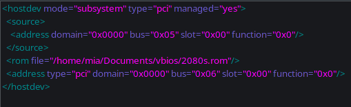

# Single GPU passthrough
> Last updated: 2021-09-18 6:00pm EDT

So you wanna game but you also wanna use Linux? That's understandable. This guide should help you with that.

# **THIS GUIDE IS NOT FINISHED YET**

# Notices

!!! warning
    This guide is less of a full "here's how everything works" and more of a jumpstart into this. **PLEASE DO RESEARCH AND DO NOT RELY ON THIS ALONE** All pages I use will be at the bottom in the credits. 

!!! info "Current setup"
    The following are what this guide is based on, please make sure to change certain steps for your build. Read the credits for help.

    *    A machine running an arch based distro
    *    An EVGA RTX 2080 Super Black
    *    An AMD Ryzen 5 5600x

    At some points I will provide the intel commands, but please make sure to read the credits for all the guides that go more in-depth.

!!! warning "Before Installing Linux"
    Aight before you even get to Linux (If you're still on Windows) dump your GPUs vBIOS using [GPUz](https://www.techpowerup.com/gpuz/). You're gonna need it in a much later step. Just back it up and keep it somewhere you can get to later.

Now that we got that out of the way, lets get to installing, crying, and a lot of screaming.

# Dependencies
Single GPU passthrough will need some stuff installed in order to work. Running the following list of commands will install everything for you.

```bash
sudo pacman -S qemu libvirt edk2-ovmf virt-manager iptables-nft dnsmasq
sudo systemctl enable --now libvirtd.service
sudo virsh net-autostart default
sudo virsh net-start default
sudo usermod -aG kvm,input,libvirt <your_name>
```

# Enable & Verify IOMMU
Before you start setting up VMs, go to your BIOS and enable either Intel VT-d or AMD-Vi + IOMMU depending on your processor and motherboard. If you're using AMD and you do not see the IOMMU option, you should be fine, but do research.

After enabling that in your BIOS you're now gonna have to edit grub and add either one of the following depending on your processor.

| /etc/default/grub |
| ----- |
| `GRUB_CMDLINE_LINUX_DEFAULT="... intel_iommu=on iommu=pt ..."` |
| OR |
| `GRUB_CMDLINE_LINUX_DEFAULT="... amd_iommu=on iommu=pt ..."` |

After you do that run `grub-mkconfig -o /boot/grub/grub.cfg` to rebuild your config with iommu grouping enabled, and then reboot.

To verify the groups run `dmesg | grep 'IOMMU enabled'`. If it does not show up then you missed something or your system does not support it. (There are instances where IOMMU will not report as enabled but still work, verify with the second part before thinking something is funky).

After making sure that IOMMU grouping is enabled, run the following script to make sure that the groups are valid, make sure that the GPU is in it's own group with all of it's stuff.

``` bash
#!/bin/bash
shopt -s nullglob
for g in `find /sys/kernel/iommu_groups/* -maxdepth 0 -type d | sort -V`; do
    echo "IOMMU Group ${g##*/}:"
    for d in $g/devices/*; do
        echo -e "\t$(lspci -nns ${d##*/})"
    done;
done;
```
If the groups are not valid, you will need to do [ACS patching](https://wiki.archlinux.org/title/PCI_passthrough_via_OVMF#Bypassing_the_IOMMU_groups_(ACS_override_patch)) Which is out of the scope of this project, follow the guide linked.

While doing this, copy all the text for your GPUs IOMMU group and save it to a file somewhere to easily find.

# Setting up the VM
This guide is going to assume that you want to set up a Windows 10 VM, In the future I will make a guide for a MacOS VM, but now is not the time.

## Downloading Drivers
Yes I'm telling you to download the drivers before downloading the OS, why? Cause fuck you, you're gonna forget to download them later and skip to installing. Anyways click [here](https://fedorapeople.org/groups/virt/virtio-win/direct-downloads/latest-virtio/virtio-win.iso) for the latest virtio drivers.

## Downloading Windows 10
Aight now you need a shit OS to install huh? [This](https://www.microsoft.com/en-us/software-download/windows10ISO) page will be where you download Windows 10.

## Setting up virt manager and all that stuff
This is recommended to do before all of this is to enable XML editing in virt managers settings. Open "Virtual Machine Manager" and click "Edit". Enable XML editing and hit close.

### Base setup
Aight this is the fun part, click `"New VM" > Local install media > Browse > Browse Local` and select the ISO you download for Windows 10. If it asks for search permission give it permission. Whatever it asks of you give it.

Next is memory and CPUs, I gave it half of my RAM and all but 2 cores of my CPU.

Then give it some storage, I gave mine 500GB just to survive more than an hour with the bloatware that is in win10.

After giving it a reasonable amount of storage, name your vm, or keep it default. Just make sure that you note down what it's called. Also check the box that says "Customize configuration before install".

### Customizing Install
Aight in the "Overview" section set the firmware to the UEFI setting that does not have `secboot` in the name.

Then go to "CPUs" and uncheck "Copy host CPU configuration" and set the model to "Host passthrough".

Then open the dropdown for Topology and check the "Manually set CPU topology" option/ Then set the information there so the vCPU allocation matches what you put in the base setup.

Go into "Boot Options" and check CDROM and move it to the top of the boot list (this should uhh.. really be on by default but okay).

Then go to the SATA Disk for the VM and set it to VirtIO.

Do the same for your NIC, just set it to VirtIO and it'll be fine.

Last add another CDROM for the virtio iso.

After that you can hit Begin Installation.

### The First boot/Install
Once you hit begin installation, wait til it asks you to press any button to boot from CD. Press something and go through the setup until you're asked how you want to do the install

Select Custom and select your... oh wait there's no disk. Hit "Load driver" and install the win10 driver. Then select your disk and do your standard windows 10 install.

Once you're at the desktop, open file explorer and install the drivers from the virtio CD. Once that is complete you can shut down the VM.

### Cleaning up the VM details
This is a small section to just make management later a bit easier.

In your VM details go to "Boot Options" and disable the CDROM options.

Next remove both CDROMS (you can delete the files if you want)

#### Optional Removal (untseted as of writing)
You can also remove `Channel Spice, Display Spice, Video QXL, Sound ich*` if you want. I have not tested this but one of the guides suggests doing this

# Hijacking a GPU
This part sucks the most IMHO.

## QEMU hooks
You ready to learn the wonders of qemu hooks? Cause if not you don't have a choice.

Under construction...

## Patching the GPU
>This step is not required for all GPUs. It's needed for mine so I will go over that. Look up if you need to do it.

First thing you're gonna wanna do is get the file you dumped in [this step](1gpu_pass.md#before-installing-linux) and put it somewhere you will remember. I put mine in a `vbios` folder in my `Documents` directory.

Next you want to install a hex editor, for this guide I'm using Bless so run `sudo pacman -S bless` and open it.

Next make sure that you have a backup of the file before opening it in the hex editor. After you make a backup open the original and get ready for patching

Open the file and hit `CTRL+F` and type "VIDEO" and and search as Text. Find the closest "U" in front (hex 55) and delete **EVERYTHING** infront of it. (The file size difference for my GPU was ~130kb). Once you do that save the file and close bless.

## Attaching the GPU to the VM
This is my least favorite part as it just takes time and is annoying as shit to do.

To start this step go ahead and attach all of your GPU stuff to your VM by clicking `Add Hardware > PCI Host Device` and adding everything for the GPU.. one at a time. After you do that click on one of the devices and go to `XML` under `</source>` add a line similar to this for your patched vBIOS `<rom file="/home/mia/Documents/vbios/2080s.rom"/>`. It should look similar to the photo below



After you do it to one of them.. Do it to the rest of them. That's right folks you need to do it to all of them.

Under construction...

!!! tldr "Credits"
    [Arch Wiki](https://wiki.archlinux.org/title/PCI_passthrough_via_OVMF)

    [QaidVoid/Complete-Single-GPU-Passthrough](https://github.com/QaidVoid/Complete-Single-GPU-Passthrough)

    [virtio drivers](https://github.com/virtio-win/virtio-win-pkg-scripts)

    [Passthrough Post](https://passthroughpo.st/simple-per-vm-libvirt-hooks-with-the-vfio-tools-hook-helper/)