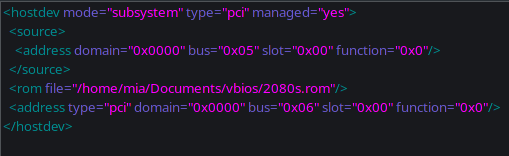

# Single GPU passthrough
> Last updated: 2022-05-26

## Notices
!!! warning
    This guide is less of a full "here's how everything works" and more of a jumpstart into this. **PLEASE DO RESEARCH AND DO NOT RELY ON THIS ALONE** All pages I use will be at the bottom in the credits. 

!!! info "Current setup"
    The following guide is largely based on these dependencies, please make sure to change certain steps for your build. Read the credits for help.

    *    Linux
    *    An Nvidia GPU
    *    An AMD CPU

## QEMU hooks
You ready to learn the wonders of qemu hooks? Cause if not you really don't have a choice.

### Installing
To get started you need to make a few folders for the hooks so run `sudo mkdir -p /etc/libvirt/hooks` to make said folders.

Next thing you want to do is download the hook manager itself by running the following commands:

``` bash
sudo wget 'https://raw.githubusercontent.com/PassthroughPOST/VFIO-Tools/master/libvirt_hooks/qemu' \
     -O /etc/libvirt/hooks/qemu
sudo chmod +x /etc/libvirt/hooks/qemu
sudo systemctl restart libvirtd
```
And there ya go, you've now installed the manager for the hooks.. time to write them.

### Making your own hooks
This section is annoying but honestly kinda my favorite. We now have to write the scripts that will tell our computer to give the virtual machine the graphics card. 

I hope you know what your VM is called cause now would be the time to know the name.

To get started you want to make the folder structure below: 
```
/etc/libvirt/hooks
├── qemu
└── qemu.d
    └── <vm_name>
        ├── prepare
        │   └── begin
        ├── release
        │   └── end
```

With your folders created now we need to make some scripts. You need to put the scripts in the proper begin/end folder for their jobs. Below are some examples with the path of them as the name. You can use these examples but you need to remember to change certain things for your builds, like your dm, vtcons, and drivers.

??? info "/etc/libvirt/hooks/kvm.conf"
    ```
    VIRSH_GPU_VIDEO=pci_0000_05_00_0
    VIRSH_GPU_AUDIO=pci_0000_05_00_1
    VIRSH_GPU_USB=pci_0000_05_00_2
    VIRSH_GPU_SERIAL=pci_0000_05_00_3
    ```
You might be wondering what those numbers are in that file? It's the numbers we got from our IOMMU groupings earlier. the `pci_0000` part is required.

??? info "/etc/libvirt/hooks/qemu.d/<vm_name\>/prepare/begin/start.sh"
    ``` bash
    # File based on "SomeOrdinaryGamers" scripts.
    # Anything labeled with a * in the comment needs to be edited by you to work with your setup

    # debugging
    set -x

    # load vars
    source "/etc/libvirt/hooks/kvm.conf"

    # kill the DM*
    systemctl stop sddm.service

    # Unbind VTconsoles*
    echo 0 > /sys/class/vtconsole/vtcon0/bind
    echo 0 > /sys/class/vtconsole/vtcon1/bind

    # Unbind EFI-framebuffer
    echo efi-framebuffer.0 > /sys/bus/platform/drivers/efi-framebuffer/unbind

    # Avoid race condition*
    sleep 5

    # Unload Nvidia Drivers*
    modprobe -r nvidia_uvm
    modprobe -r i2c_nvidia_gpu
    modprobe -r nvidia_drm
    modprobe -r nvidia_modeset
    modprobe -r nvidia

    # Unbind GPU*
    virsh nodedev-detach $VIRSH_GPU_VIDEO
    virsh nodedev-detach $VIRSH_GPU_AUDIO
    virsh nodedev-detach $VIRSH_GPU_USB
    virsh nodedev-detach $VIRSH_GPU_SERIAL

    # Isolate the CPU
    systemctl set-property --runtime -- user.slice AllowedCPUs=0,6
    systemctl set-property --runtime -- system.slice AllowedCPUs=0,6
    systemctl set-property --runtime -- init.scope AllowedCPUs=0,6

    # load vfio
    modprobe vfio
    modprobe vfio_pci
    modprobe vfio_iommu_type1
    ```

??? info "/etc/libvirt/hooks/qemu.d/<vm_name\>/release/end/revert.sh"
    ``` bash
    # File based on "SomeOrdinaryGamers" scripts.
    # Anything labeled with a * in the comment needs to be edited by you to work with your setup
    
    # debugging
    set -x
    
    # Restart linux host entirely (debug line)
    # reboot
    
    # load vars
    source "/etc/libvirt/hooks/kvm.conf"
    
    # Unload vfio
    modprobe -r vfio
    modprobe -r vfio_pci
    modprobe -r vfio_iommu_type1
    
    # Unisolate the CPU
    systemctl set-property --runtime -- user.slice AllowedCPUs=0-11
    systemctl set-property --runtime -- system.slice AllowedCPUs=0-11
    systemctl set-property --runtime -- init.scope AllowedCPUs=0-11
    
    # Rebind GPU*
    virsh nodedev-reattach $VIRSH_GPU_VIDEO
    virsh nodedev-reattach $VIRSH_GPU_AUDIO
    virsh nodedev-reattach $VIRSH_GPU_USB
    virsh nodedev-reattach $VIRSH_GPU_SERIAL
    
    # Rebind VTconsoles*
    echo 1 > /sys/class/vtconsole/vtcon0/bind
    echo 1 > /sys/class/vtconsole/vtcon1/bind
    
    # Read Nvidia x config* (remove if on AMD)
    nvidia-xconfig --query-gpu-info > /dev/null 2>&1
    
    # Rebind EFI-framebuffer
    echo "efi-framebuffer.0" > /sys/bus/platform/drivers/efi-framebuffer/bind
    
    # Reload Nvidia Drivers*
    modprobe nvidia_uvm
    modprobe i2c_nvidia_gpu # Key was rejected by service
    modprobe nvidia_drm # Key was rejected by service
    modprobe nvidia_modeset
    modprobe nvidia

    # Start the DM*
    systemctl start sddm.service
    ```

Make sure that all the scripts are runable by doing `sudo chmod +x /path/to/each/script.sh` to all of the scripts.

Once that's all done you can test them by running the start script, if you're screen goes black then boom it worked and you did it right. Now go hold the power button down to restart it so you can continue.

## Hijacking a GPU
### Patching the GPU
>This step is not required for all GPUs. I'm covering it for most NVIDIA cards just to make it easier if you actually need it.

First thing you're gonna wanna do is get the file you dumped in [this step](1gpu_pass.md#before-installing-linux) and put it somewhere you will remember. I put mine in a `vbios` folder in my `Documents` directory.

Next you want to install a hex editor, for this guide I'm using Bless so install and open it.

Next make sure that you have a backup of the file before opening it in the hex editor. After you make a backup, open the original and get ready for patching.

Open the file and hit `CTRL+F` and type "VIDEO" and and search as Text. Find the closest "U" in front (hex 55) and delete **EVERYTHING** before of it. (The file size difference for my GPU was ~130kb). Once you do that save the file and close bless.

??? info "guide for patching"
    
    

### Attaching the GPU to the VM
This is my least favorite part as it just takes time and is annoying as shit to do.

To start this step go ahead and attach all of your GPU stuff to your VM by clicking `Add Hardware > PCI Host Device` and adding everything for the GPU.. one at a time. After you do that click on one of the devices and go to `XML` under `</source>` add a line similar to this for your patched vBIOS `<rom file="/path/to/vbios/file.rom"/>`. It should look similar to the photo below



After you do it to one of them.. Do it to the rest of them. That's right folks you need to do it to all of them.

After you do this go to the option that says `Video QXL`, click it and replace "QXL" with "none".

After you do that start the VM and watch as your screens go black and you should boot to Windows 10. 

## Hiding the VM
If you would like to try to mask the VM, check out [hiding](../hide) the VM.

## Ending comments
This guide might not be the best or work for everyone, please see the credits below. I hope that this at least makes some sense to someone and they're able to use this to help them set up a "perfect" gaming VM.

!!! tldr "Credits"
    [Arch Wiki](https://wiki.archlinux.org/title/PCI_passthrough_via_OVMF)

    [QaidVoid/Complete-Single-GPU-Passthrough](https://github.com/QaidVoid/Complete-Single-GPU-Passthrough)

    [virtio drivers](https://github.com/virtio-win/virtio-win-pkg-scripts)

    [Passthrough Post](https://passthroughpo.st/simple-per-vm-libvirt-hooks-with-the-vfio-tools-hook-helper/)