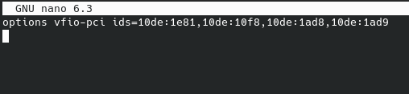

# Not Single GPU passthrough
> Last updated: 2022-05-26

Have an extra GPU and don't need the other guide? Perfect, after bribing AMD at PAX 2022 with like.. $700 I was able to get a second card for my machine to do this.

This is also gonna be borderline copy/paste of the other guide... so yeah

## Notices
!!! warning
    This guide is less of a full "here's how everything works" and more of a jumpstart into this. **PLEASE DO RESEARCH AND DO NOT RELY ON THIS ALONE!!**

## Editing configs
### Yoinking the GPU
Unlike the single GPU guide, this one disables the GPU entirely in linux, so make sure that you're not connected to it at all.

Get the text from the IOMMU groups ready, because you're gonna need that in a moment.

Make a file with `sudo nano /etc/modprobe.d/vfio.conf` and put type `options vfio-pci ids=` and put the ids at the end of the device into the file, separating them with a comma (the ids have the colon in them, copy both parts of it for each). It should look similar to the following.



### Modifying the ramdisk
Run `sudo nano /etc/mkinitcpio.conf`

In the `MODULES=()` add `vfio_pci vfio vfio_iommu_type_1 vfio_virqfd` in that order and at the start

Then go to `HOOKS=(...)`, if `modconf` isn't in that list, add it.

After you do that, run `sudo mkinitcpio -P` and reboot

## Setting up the VM
>This part I'm not sure the correct way cause I did this whole thing without a mouse and borderline blind, so sorry for the weird steps here

Much like the single GPU guide, you need to give the VM the GPU in order for it to use it.

Pass everything by adding hardware > PCI host device > and adding everything for the GPU

Next pass the mouse and keyboard in and start the VM

Plug a display into the GPU and go install the graphic drivers for the card.

Next install [looking-glass](https://looking-glass.io/) bleeding edge (it has sound support). (you will need to compile the client on linux to connect to the VM, so make sure to note which version you're downloading). **MAKE SURE LOOKING GLASS STARTS ON BOOT!**

After you have everything installed to the VM, shut it down, detach the keyboard and mouse, and compile the looking-glass version you're using.

### Setting up looking-glass client
Edit the xml for the VM and add the following to devices.
```xml
...
<shmem name='looking-glass'>
  <model type='ivshmem-plain'/>
  <size unit='M'>32</size>
</shmem>
...
```

If you have a memballoon option, set the model to none to clear it.

Then go to video and set it to `none`.

Remove the tablet from the VM and add `<input type='keyboard' bus='virtio'/>` to the xml to pass the keyboard in.

then run the `sudo touch /dev/shm/looking-glass && sudo chown $(whoami):kvm /dev/shm/looking-glass && sudo chmod 660 /dev/shm/looking-glass`.

After that you are all set to use the VM normally.

## Making sure shit works
Start the VM and you should notice you can still use your keyboard and mouse in linux, but can't see the VM. This is correct.

Run the `looking-glass-client` you compiled earlier and when the VM is fully booted, you should see the virtual machine.

Hold Scroll Lock to see the keybinds you can use, `ScrLk + F` will full screen the VM, while hitting just `ScrLk` will lock your mouse and most keyboard inputs the the VM.

## Hiding the VM
If you would like to try to mask the VM, check out [hiding](../hide) the VM.

!!! tldr "Credits"
    [Hiding the VM](https://www.youtube.com/watch?v=rrlpg6F82S4)

    [Hiding the VM pt 2](https://www.youtube.com/watch?v=VKh2eKPnmXs)