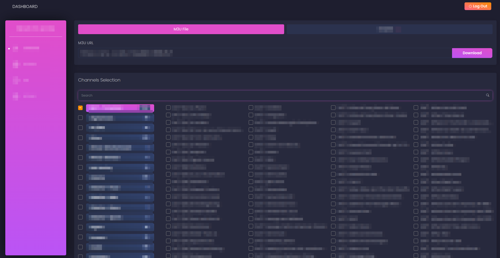
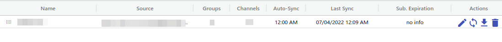
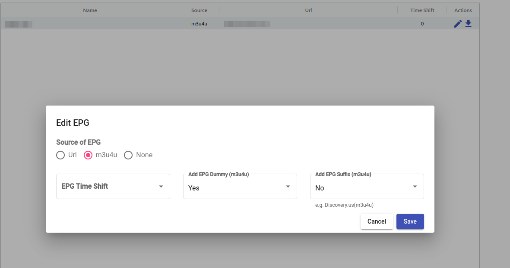

# Setting up IPTV and EPG

Got an IPTV subscription and wanna use it with Jellyfin? Well that's great. I'm the least qualified person to tell you how to do this, so I'm gonna tell you how to do it.

> Please note that I am not a sellout. I am not paid or been asked by anyone to include a link to them in this guide. If I ever get asked to swap a link for yours/endource your product, you will be ignored.

## Finding an IPTV provider

So to state some things. I can not directly link you to a provider. I do not have recommendations as I have not looked too far into the subject and currently use one that I was recommended by a sorta trusted source. [Here](https://www.softwaretestinghelp.com/iptv-service-providers/) is literally a random list I found on Google. I did not proof check this, I'm just linking one to help some people on a search.

### Setting up your m3u file

This section is gonna be a bit wonky, as each IPTV provider does this differently. But the main goal here is to create an m3u file and grab the link they give you for downloading it. The page should look similar to below, copy that link, you will need it later.



## Setting up an EPG

Now that you have an IPTV provider, it's time to set up the EPG, or Electronic Programme Guide, or in very simple terms.. the guide button on your TV remote. The best site for doing this is [m3u4u.com](https://m3u4u.com/). It's free and hella fast.

### Adding your m3u file

After you create an account, go to `Playlists > Manager` and click `Create Playlist`. Give the source a name, select `M3U Url` and add the link to the m3u file your IPTV provider gave you. It should look similar to this when done.



Then click the download button and save that URL somewhere, you will need it later

### Manually Updating the EPG

Now that we have a source for the EPG, it's time to edit the EPG and make sure that channels are marked correctly. Go to `EPGs > Manager` and make sure that the source is set to m3u4u.



Similar to above, press the download button, click the `no compression` option and copy that URL somewhere.

Then go to `EPGs > Assign TVG Id` and go through each option and make sure your stations are labeled correctly. Use their list of IDs in `EPGs > Our List` to label everything, if a station does not exist, give it a unique ID so that Jellyfin does not merge it with other ones. Once you're done with that you can optionally go back to the `Playlists` options and give custom logos and change the names, but the guide will skip over that for now.

## Connecting these to Jellyfin

Due to m3u4u's guidelines, you can not directly put the links it gives you into Jellyfin, as you will most likely get your account locked. `The chances of achieving an efficient playlist and epg without is minimal, whilst the chance of being banned is massive. - Robcwm`

### The script

So there's a script that they recommend in the wiki to auto update your local m3u and xml file for the guide and stations. I personally found the script a bit gross so I decided to rewrite it to work a bit better. Save this script in the folder you plan to store the IPTV stuff in.

??? tldr "iptv.sh"
    ```bash
    #!/bin/sh
    M3U=<url to M3U provided by m3u4u>
    EPG=<url to M3U provided by m3u4u>
    FOLDER=<absolute folder the script is in>
    cd $FOLDER
    echo "Updating iptv"
    # Backup M3U
    cp iptv.m3u iptv.m3u.bak
    # Download playlist
    curl $M3U -o iptv.m3u -f -s
    # Pause so m3u4u doesn't get upset
    sleep 15
    # Backup EPG
    cp iptv.xml iptv.xml.bak
    # Download EPG
    curl $EPG -o iptv.xml -f -s  
    ```

I also recommend adding a cron job to run this script daily, the following cron job will have it download these files at 1am everyday
`0 1 * * * /media/iptv.sh`

### In Jellyfin

Now that you have the script all set up, go into Jellyfin and navigate to `Administrator - Dashboard > Live TV - Live TV`. Press the top `+` and set the tuner to `M3U Tuner` and set the path to the file and save. Afterwards click the `+` next to `TV Guide Data Providers`, select `XMLTV` and set the path to the xml file.
