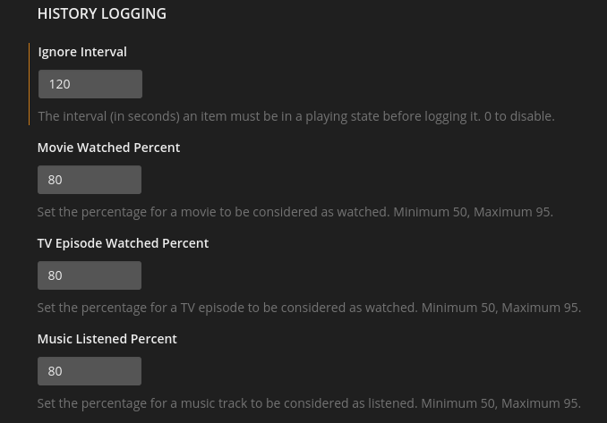

# Setting up Tautulli

!!! info
    [Tautulli](https://tautulli.com/) is a 3rd party application that you can run alongside your Plex Media Server to monitor activity and track various statistics.

## Installing

To install Tautulli follow the [alternate installation instructions](https://github.com/Tautulli/Tautulli/wiki/Installation#linux) on their wiki. If you do not want to use scripts with Tautulli, then follow the [docker instructions](https://github.com/Tautulli/Tautulli/wiki/Installation#docker)

## Configure

Now that we have Tautulli installed, we can now set it up to send messages to stuff like Discord, Telegram, Slack, and a lot more.

First thing you're gonna wanna do is go to settings and click "Show Advanced". This will show the settings we need to edit

### History Logging

If you wanna use a script that runs when someone finishes an episode, but you know that people skip the last 3 minutes of an episode cause the saw a single credit popup, then you might wanna lower the number. I personally use 80 as it seems to catch 99.99% of streams.

### Image Hosting

This one you can set up how you want, Go to "3rd Party APIs" and use either Imgur or Cloudinary. I personally use cloudinary and prefer that over Imgur as it seems to work just a bit faster. After you set one of those up, scroll down and check "Lookup TheMovieDB Links" and "Lookup TVmaze Links".