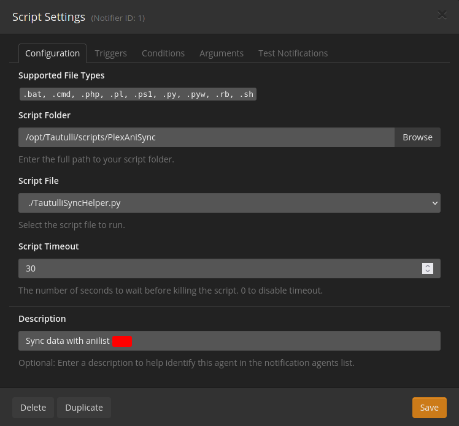
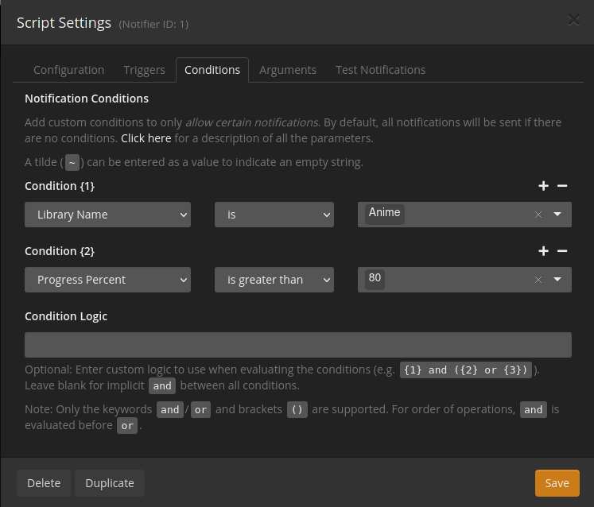

# Tautulli Scripting

Aight now we get to the fun part, actually setting up scripts. I'm gonna go over one script here as I use it the most.

## PlexAniSync
My friends and I watch a lot of anime and keeping our Anilist accounts up to date is like 4 more clicks than we feel like. The solution? [PlexAniSync](https://github.com/RickDB/PlexAniSync).

### Installing

!!! note "Installing"
    You can set this up in 2 ways, manually, or use their docker image that has Tautulli installed in it. I'm gonna go over manually as that's how I have it set up and prefer it that way.

Installation is very easy, clone the repo somewhere and yell at tautulli to look at it. To make my life easier, I made a "scripts" folder in the Tautulli directory and cloned it in there, so my path looks like this `/opt/Tautulli/scripts/PlexAniSync`. Make sure to also install the pip deps by running `pip install --user -r requirements.txt` in the folder.

### Configs

??? info
    If you did not know already, any text inside of "<>" is a name that you put yourself without the "<>"

Fun thing: if you do this for multiple users, no config will ever be the same. Follow their [config guide](https://github.com/RickDB/PlexAniSync#step-3---configuration) to set up the configs. If you name your config file differently, you can call it by doing `python PlexAniSync.py <config.ini>`.

### Custom mapping
Say you got a large media library and you did the smart thing of merging different seasons into one show to be able to find everything under one name. Now you got the new shit to deal with.. Custom Mapping.

That's right, the script *at least it used to idk how good it is now* failed when things were merged into series and not separate series. The solution? `custom_mappings.yaml`. With this file you can make everything detected how you want it. I have an example [here](https://github.com/46620/custom-mappings) with my current library, and a cron file if you want to use it. I'd recommend setting up the cronjob if you do use it as I try to update that file as often as I can with how I have shows set up.

### Setting up in Tautulli

In Tautulli go to `Settings > Notification Agents > Add a new notification agent`. Select `Script` and get ready to config a lot of stuff

First you want to set the script folder and the script to use, below is a screenshot that shows my setup, adapt the paths for yours.

Next go to triggers and check "Playback Stop" and optionally "Watched" if you want to guarantee that the script runs.

Next go to Conditions and set it up similar to the photo below. Make sure the Library Name is where you have your Anime.

Lastly go to the Arguments tab and in "Playback Stop" and "Watched" put in `<config.ini> "{show_name}"`

After you do that and save, just hope that the script works when you play, if not... something something change the python env in the `TautulliSyncHelper.py` to use py3.
